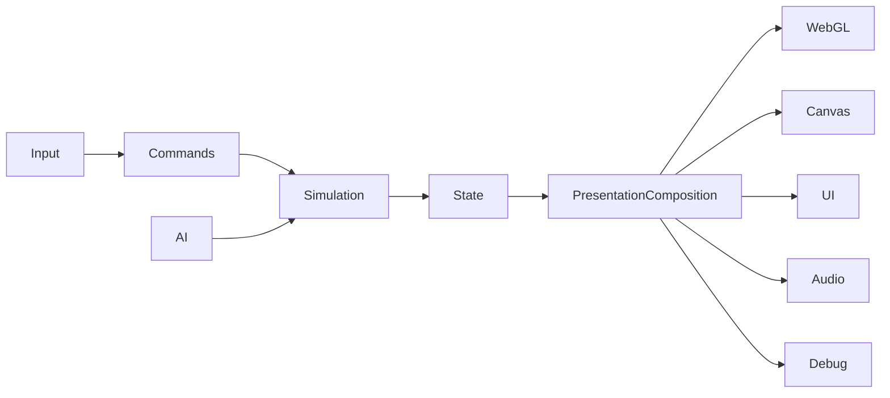

# Architecture

## TON-85 final presentation boundary

The deployed runtime now has one browser composition root in `browser-entry.js`. HUD, radar, event audio, Three.js environment, model views, Canvas fallback, camera/replay, settings and effects are adapter-owned. Tracked `game.js` no longer creates or renders those presentation owners; it publishes immutable compatibility facts through `__TONY_COMPATIBILITY_PRESENTATION_PORT__` only.

That port is frozen and outward-only. It can configure user preferences and publish presentation feedback facts, but it cannot read or mutate `MatchEngine`. Its removal owner is TON-65 after final parity evidence retires `CompatibilitySnapshotAdapter`. WebGL/model, WebGL effects and Canvas consume the same frozen camera/replay and effects projections. Engine/application modules remain browser-free and authoritative.

## Current constraint

Gameplay and AI authority have been extracted from `game.js` into the deterministic `MatchEngine` under `src/game/engine/`. The deployed browser consumes immutable snapshots and ordered events; temporary objects in `game.js` are outward-only presentation mirrors and cannot progress gameplay.

Presentation ownership is explicit across every browser surface. `BrowserPresentationComposition` creates lifecycle, HUD, radar, audio, environment, model, Canvas, camera/replay, settings, effect-state and WebGL-effect-view adapters before the simulation loop starts. `game.js` contains only compatibility composition/mirrors and the named frozen outward presentation port; no migrated presentation owner or direct render call remains there.

Use `docs/11_SOURCE_MAP.md` as the operational index from subsystem ownership to current code and tests. This document remains the source of architectural rules and target dependency direction.

## Target flow

## Target modules
`src/game/core`, `engine`, `application`, `config`, `input`, `entities`, `movement`, `ball`, `actions`, `ai`, `rules`, `render`, `presentation`, and `debug`.

## Dependency direction
Core and engine modules have no DOM, Three.js, Canvas or Web Audio dependency. Browser composition connects immutable engine contracts to presentation adapters. Renderers and UI read authoritative state but do not own physics, lifecycle or AI decisions.

## Runtime contracts

- Browser input adapters translate keyboard state into immutable gameplay commands and expose only frozen presentation facts such as active charge and pressed codes.
- `MatchEngine` consumes commands only on fixed simulation ticks.
- Commands with a future `targetTick` remain buffered until that tick is reached.
- The engine owns players, ball, score, statistics, match lifecycle, and gameplay event ordering.
- The engine publishes read-only snapshots for rendering and typed events for presentation feedback.
- `BrowserPresentationComposition` owns presentation adapter creation, best-effort startup rollback, reset and reverse-order teardown. Cleanup attempts every adapter, always clears composition state and reports any collected failures after resources have been released.
- Browser bootstrap may accept presentation adapter factories, but application modules never import Three.js. Factories receive only frozen `target` and `document` lifecycle context.
- Browser bootstrap publishes frozen presentation frames containing current/previous snapshots, interpolation alpha, frame time, control mode, active charge and pressed codes.
- Browser bootstrap invokes the presentation-ready bridge after adapters attach and before the simulation loop starts. Remaining compatibility trail/particle/camera views therefore connect to an already-created clean scene host without creating a second renderer or scene.
- `ThreeSceneEnvironmentAdapter` owns WebGL availability, resize, context loss/restoration, explicit Canvas fallback signaling and scene-host lifecycle.
- `BrowserThreeSceneEnvironmentHost` owns only environment resources. Objects registered through the port are foreign-owned: teardown detaches them without disposing their geometry, materials or textures.
- `ThreeSceneEnvironmentProfile` is one deeply frozen, validated seam for world/field/goal geometry, renderer background/fog/exposure, camera defaults, lighting and pitch-environment styles. Defaults preserve current visuals; the active profile id is exposed through immutable diagnostics.
- The scene-host port exposes only object registration, immutable camera-pose operations, quaternion copy, render requests and immutable diagnostics. Raw renderer, scene, camera and composer handles do not cross the boundary.
- `BrowserModelViewAdapter` consumes immutable snapshot frames through `SnapshotRenderState`, reconciles views by stable ids and never receives mutable compatibility player or ball objects.
- `PlayerModelView` owns procedural/rigged player projection, kit materials, mixer/actions, markers and labels. `BallModelView` owns ball surface projection and the charge indicator. Both register only through the frozen scene port and dispose only their own resources.
- Model asset failure is presentation-local: character failure preserves procedural players; animation failure preserves the loaded model with safe basic motion.
- Presentation factories and reset hooks receive only browser-safe lifecycle context. Runtime and snapshot mutation capabilities are not exposed; gameplay facts arrive only through immutable render frames and ordered events.
- After-render presentation failures are isolated from the fixed simulation loop. Remaining listeners still run and the next frame is scheduled while the loop remains active.
- Three.js, Canvas fallback, radar, HUD, audio, and presentation flows may consume snapshots and events but may not mutate engine state.
- Browser match-event audio is owned by `BrowserAudioAdapter` only while its Web Audio backend remains usable. Context or node creation failure releases ownership during the event so the compatibility callback can provide the required fallback; direct settings-preview tones remain a named `game.js` bridge until the settings adapter slice.
- Render interpolation may blend previous and current snapshots without changing authoritative positions.
- Start, restart, and kickoff resets are snapshot discontinuities; their first render frame uses `previous === current` and never blends entities across matches or kickoffs.
- Application commands own navigation and match lifecycle requests; DOM clicks are not an integration API.

## Source-of-truth rule

The engine state is authoritative. Scene nodes, animation mixers, canvas coordinates, DOM text, CSS classes, replay badges, audio nodes and HUD values are projections. Presentation must never infer a gameplay fact from a rendered projection when the engine can publish that fact directly.

## Migration rule
Extract the smallest complete subsystem per sprint and retain only narrow, named compatibility ports to the current game.

R1 uses parity-first migration: establish contracts, move one complete responsibility at a time, keep compatibility adapters only while needed, and remove each bridge after equivalent contract coverage exists. A full rewrite, framework migration, visual redesign or gameplay retuning is not permitted.
