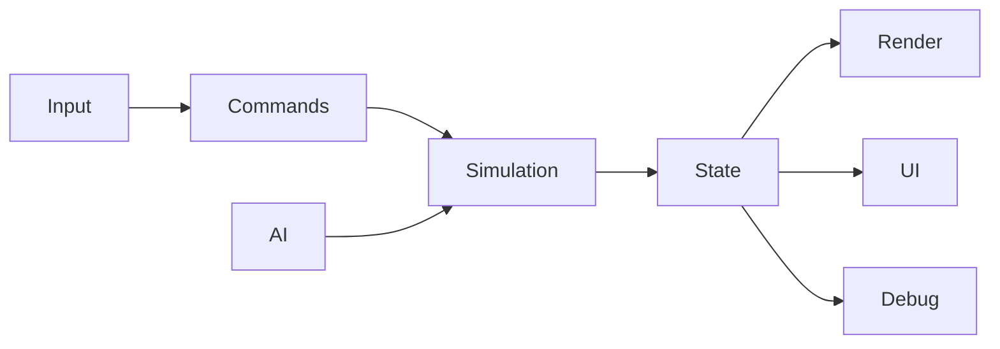

# Architecture

## Current constraint
Gameplay, AI, rendering, animation, replay, much of the UI projection, and asset loading are concentrated in `game.js`.

The fixed 60 Hz clock, browser input, application actions, engine contracts, and several gameplay/presentation helpers are extracted. Goal, replay, and match-ended presentation facts cross an immutable browser event bridge. The compatibility runtime publishes previous/current immutable snapshots; a pure render-state adapter interpolates player and ball transforms for both Three.js and Canvas, while HUD and radar consume current snapshots. Authoritative compatibility state, camera, replay, audio, and match lifecycle application still share one runtime closure. R1 is the approved sprint that establishes the enforceable boundary; it does not replace the existing fixed-timestep work.

Use `docs/11_SOURCE_MAP.md` as the operational index from subsystem ownership to current code and tests. This document remains the source of architectural rules and target dependency direction.

## Target flow

## Target modules
`src/game/core`, `engine`, `application`, `config`, `input`, `entities`, `movement`, `ball`, `actions`, `ai`, `rules`, `render`, `presentation`, and `debug`.

## Dependency direction
Core has no DOM or Three.js dependency. Renderers and UI read authoritative state but do not own physics or AI decisions.

## Runtime contracts

- Browser input adapters translate keyboard state into immutable gameplay commands.
- `MatchEngine` consumes commands only on fixed simulation ticks.
- The engine owns players, ball, score, statistics, match lifecycle, and gameplay event ordering.
- The engine publishes read-only snapshots for rendering and typed events for presentation feedback.
- Three.js, Canvas fallback, radar, HUD, audio, and presentation flows may consume snapshots and events but may not mutate engine state.
- Render interpolation may blend previous and current snapshots without changing authoritative positions.
- Application commands own navigation and match lifecycle requests; DOM clicks are not an integration API.

## Source-of-truth rule

The engine state is authoritative. Scene nodes, animation mixers, canvas coordinates, DOM text, CSS classes, replay badges, and HUD values are projections. Presentation must never infer a gameplay fact from a rendered projection when the engine can publish that fact directly.

## Migration rule
Extract the smallest complete subsystem per sprint and retain adapters to the current game.

R1 uses parity-first migration: establish contracts, move one complete responsibility at a time, keep compatibility adapters only while needed, and remove each bridge after equivalent contract coverage exists. A full rewrite, framework migration, or gameplay retuning is not permitted.
