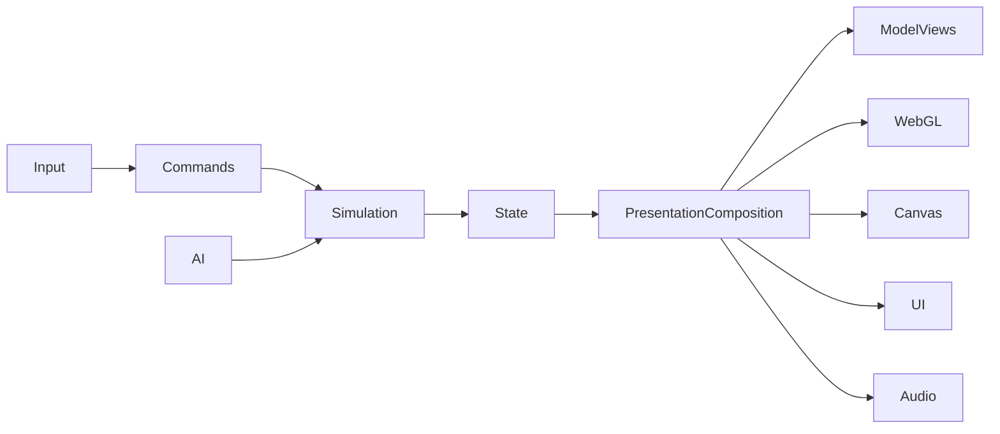

# Architecture

## Current constraint

Gameplay and AI authority live in the deterministic `MatchEngine` under `src/game/engine/`. The deployed browser consumes immutable snapshots and ordered events; compatibility objects in generated `game.js` are outward-only presentation mirrors and cannot progress gameplay.

Presentation ownership is explicit for lifecycle, HUD, radar, event audio, the Three.js scene/environment, and player/ball/model animation. `BrowserPresentationComposition` creates adapters before the simulation loop starts. `ThreeSceneEnvironmentAdapter` owns the renderer/scene/environment lifecycle. `BrowserModelViewAdapter` consumes immutable render frames and owns player meshes, the ball mesh, model loading, kit materials, animation mixers, selection markers, labels and the WebGL charge indicator. Generated `game.js` retains Canvas fallback, settings callbacks, particles, trails, preview tones and camera/replay decisions until their dedicated slices.

Use `docs/11_SOURCE_MAP.md` as the operational index from subsystem ownership to code and tests.

## Target flow

## Dependency direction

Core and engine modules have no DOM, Three.js, Canvas or Web Audio dependency. Browser composition connects immutable engine contracts to presentation adapters. Renderers and UI read authoritative state but never mutate physics, lifecycle, possession, score, AI or animation intent.

## Runtime contracts

- Browser input adapters translate keyboard state into immutable gameplay commands.
- `MatchEngine` consumes commands only on fixed simulation ticks.
- The engine owns players, ball, score, statistics, match lifecycle and gameplay event ordering.
- The engine publishes read-only snapshots and typed ordered events.
- `BrowserPresentationComposition` owns adapter creation, startup rollback, reset and reverse-order teardown.
- Browser bootstrap passes factories only frozen `{ target, document }` lifecycle context.
- Render frames contain immutable current/previous snapshots, interpolation alpha, time, control mode, active charge and pressed-code presentation facts.
- `ThreeSceneEnvironmentAdapter` owns WebGL availability, resize, context loss/restoration, fallback signaling and clean-host lifecycle.
- `BrowserThreeSceneEnvironmentHost` owns only environment resources. Objects registered through the port are foreign-owned.
- `BrowserModelViewAdapter` reconciles player views by stable snapshot id, creates one ball view, and projects immutable interpolation state.
- `PlayerModelView` owns procedural fallback geometry, cloned rig, per-player kit materials, mixer/actions, labels and selection marker.
- `BallModelView` owns the ball surface/mesh and WebGL charge indicator. Canvas charge drawing remains part of TON-82.
- `BrowserPlayerAssetLoader` owns GLTF/Meshopt loading, timeout/retry and independent character/animation degradation.
- Model loading failure preserves procedural players; animation failure preserves the loaded static model with basic projection.
- Model adapters register objects only through the stable `ThreeSceneHostContract`; they never access renderer, scene, camera or composer handles.
- Context restoration replays registered model objects through the stable scene façade without recreating model ownership.
- Player/ball model views dispose their own resources. The scene host detaches but never disposes them.
- Model animation selection is a render projection and cannot change simulation state.
- Camera/replay decisions remain TON-83. Particles/trails/settings remain TON-84. Canvas extraction remains TON-82.
- Presentation failures are isolated from the fixed simulation loop.
- Render interpolation may blend snapshots but never changes authoritative positions.
- Start, restart and kickoff resets are snapshot discontinuities and do not blend across matches.

## Source-of-truth rule

The engine state is authoritative. Scene nodes, animation mixers, canvas coordinates, DOM text, CSS classes, replay badges and audio nodes are projections. Presentation must never infer a gameplay fact from a rendered projection when the engine publishes that fact directly.

## Migration rule

Extract the smallest complete subsystem per sprint and retain only narrow, named compatibility ports. R1 is parity-first: no framework rewrite, visual redesign or gameplay retuning.
