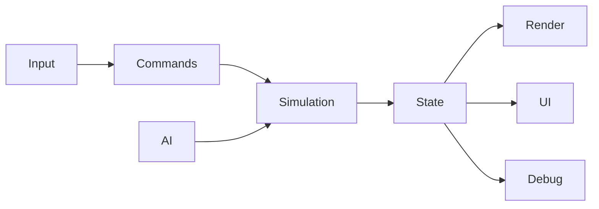

# Architecture

## Current constraint
Gameplay, AI, rendering, input, animation, replay, UI, and asset loading are concentrated in `game.js`.

## Target flow

## Target modules
`src/game/core`, `config`, `input`, `entities`, `movement`, `ball`, `actions`, `ai`, `rules`, `render`, and `debug`.

## Dependency direction
Core has no DOM or Three.js dependency. Renderers and UI read authoritative state but do not own physics or AI decisions.

## Migration rule
Extract the smallest complete subsystem per sprint and retain adapters to the current game.