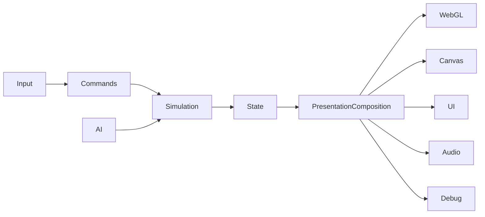

# Architecture

## Current constraint

Gameplay and AI authority have been extracted from `game.js` into the deterministic `MatchEngine` under `src/game/engine/`. The deployed browser consumes immutable snapshots and ordered events; temporary objects in `game.js` are outward-only presentation mirrors and cannot progress gameplay.

The remaining constraint is presentation ownership. Three.js/WebGL, Canvas fallback, model animation, DOM/HUD binding, settings, audio, particles, trails and several overlay callbacks are still co-located in `game.js`. Pure snapshot/event projections already exist for render state, camera, replay, HUD, radar and feedback. `BrowserPresentationComposition` is the lifecycle owner for presentation adapters, allowing each remaining implementation to be extracted behind explicit attach/render/reset/teardown contracts without re-entering engine authority.

Use `docs/11_SOURCE_MAP.md` as the operational index from subsystem ownership to current code and tests. This document remains the source of architectural rules and target dependency direction.

## Target flow

## Target modules
`src/game/core`, `engine`, `application`, `config`, `input`, `entities`, `movement`, `ball`, `actions`, `ai`, `rules`, `render`, `presentation`, and `debug`.

## Dependency direction
Core and engine modules have no DOM, Three.js, Canvas or Web Audio dependency. Browser composition connects immutable engine contracts to presentation adapters. Renderers and UI read authoritative state but do not own physics, lifecycle or AI decisions.

## Runtime contracts

- Browser input adapters translate keyboard state into immutable gameplay commands.
- `MatchEngine` consumes commands only on fixed simulation ticks.
- Commands with a future `targetTick` remain buffered until that tick is reached.
- The engine owns players, ball, score, statistics, match lifecycle, and gameplay event ordering.
- The engine publishes read-only snapshots for rendering and typed events for presentation feedback.
- `BrowserPresentationComposition` owns presentation adapter creation, startup rollback, reset and reverse-order teardown.
- Three.js, Canvas fallback, radar, HUD, audio, and presentation flows may consume snapshots and events but may not mutate engine state.
- Render interpolation may blend previous and current snapshots without changing authoritative positions.
- Start, restart, and kickoff resets are snapshot discontinuities; their first render frame uses `previous === current` and never blends entities across matches or kickoffs.
- Application commands own navigation and match lifecycle requests; DOM clicks are not an integration API.

## Source-of-truth rule

The engine state is authoritative. Scene nodes, animation mixers, canvas coordinates, DOM text, CSS classes, replay badges, audio nodes and HUD values are projections. Presentation must never infer a gameplay fact from a rendered projection when the engine can publish that fact directly.

## Migration rule
Extract the smallest complete subsystem per sprint and retain adapters to the current game.

R1 uses parity-first migration: establish contracts, move one complete responsibility at a time, keep compatibility adapters only while needed, and remove each bridge after equivalent contract coverage exists. A full rewrite, framework migration, visual redesign or gameplay retuning is not permitted.
