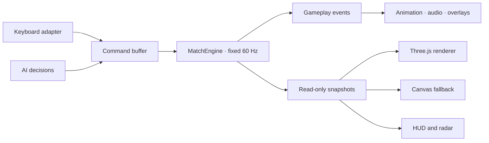

# R1 — Engine and Presentation Boundary

Status: In Progress — Slice B headless state and lifecycle foundation

## Objective

Make authoritative football gameplay runnable and testable without Three.js, Canvas, DOM, audio, or browser frame timing. Presentation becomes a consumer of read-only snapshots and explicit runtime events while current gameplay, controls, assets, and match flow remain behaviorally unchanged.

R1 implements the accepted decisions in ADR-001 and ADR-002. It does not recreate the fixed 60 Hz foundation delivered by G1.

## Current baseline

- Fixed simulation timing already runs at 60 Hz through `SimulationLoop`.
- Locomotion, ball control, and possession helpers already have headless tests.
- `game.js` still owns authoritative players, ball, match state, browser input, AI updates, replay, Three.js, Canvas fallback, radar, audio, DOM updates, and debug wiring.
- Goal and result presentation currently infer state from rendered DOM and delegate some actions through synthetic clicks.
- Render interpolation alpha exists, but entity transforms are not yet driven from previous/current engine snapshots.

## Target flow

## Delivery slices

### Slice A — Contracts and dependency guardrails

- Define immutable gameplay commands for movement, sprint, switch player, pass, through ball, lofted pass, shot, tackle, pause, restart, and match start.
- Define explicit runtime events for match lifecycle, possession, kick, score, replay, and match end.
- Define read-only previous/current match snapshots with stable player and ball identifiers.
- Add import-boundary tests proving engine modules do not access DOM, Three.js, Canvas, audio, or browser animation frames.

### Slice B — Authoritative MatchEngine

- Move creation and ownership of players, ball, score, statistics, match clock, selected player, and match lifecycle into a headless `MatchEngine`.
- Reuse the existing fixed clock, locomotion, ball-control, and possession helpers rather than duplicating them.
- Consume commands only inside fixed updates and publish events in deterministic order.
- Preserve current formations, constants, tuning, AI decisions, goal timing, replay behavior, and reset semantics.

### Slice C — Input and application adapters

- Move keyboard listeners and FO4 mapping into a browser input adapter.
- Translate key state into engine commands; input code must not move meshes or mutate player objects directly.
- Replace synthetic navigation clicks with explicit application commands.
- Centralize match start, pause, resume, restart, setup, and main-menu requests behind an application runtime.

### Slice D — Rendering and presentation adapters

- Make WebGL, Canvas fallback, radar, and HUD consume engine snapshots.
- Use snapshot interpolation for visual transforms while retaining fixed authoritative positions.
- Map facing, locomotion, and action state to model orientation and animation without writing back to the engine.
- Replace score/result `MutationObserver` integrations with explicit runtime events.
- Keep model-loading and animation fallbacks intact.

### Slice E — Explicit bootstrap and compatibility cleanup

- Make `game.js` a composition/bootstrap entrypoint instead of the owner of authoritative gameplay updates.
- Initialize presentation modules explicitly; imports must not rely on hidden side effects.
- Remove temporary DOM/state bridges after equivalent command, event, and snapshot tests pass.
- Document final module ownership and retain both WebGL and Canvas smoke paths.

## Out of scope

- Gameplay balance or tuning changes.
- New passing, shooting, tackle, goalkeeper, or AI behavior.
- FO4 control remapping.
- Player-model, ball-model, stadium, lighting, or UI redesign.
- Multiplayer, networking, replay-file persistence, backend services, or framework migration.
- Removing Canvas fallback or changing deployment targets.

## Regression risks

- A one-tick input delay when command buffering is introduced.
- Visual jitter or incorrect model facing when snapshot interpolation replaces direct mesh mutation.
- Goal, replay, and post-match event ordering drifting from current timing.
- WebGL and Canvas projections disagreeing about headings or coordinates.
- Reset, Play Again, and Match Setup retaining stale engine state.

Each slice must retain a temporary compatibility adapter until its focused unit, contract, and browser tests pass.

## Validation

### Headless and contract tests

- Start, pause, resume, reset, and end a match without browser globals.
- Feed equal command sequences at 30, 60, and 120 FPS render schedules and obtain equal authoritative snapshots.
- Verify command buffering and deterministic event ordering.
- Verify snapshots are read-only and contain no Three.js, DOM, Canvas, or audio objects.
- Verify rendering and presentation modules cannot be imported by the engine dependency graph.

### Browser tests

- FO4 movement and attacking/defending actions retain their current mappings.
- WebGL player and ball transforms follow engine snapshots without visible jitter.
- Canvas fallback remains playable and agrees with WebGL headings.
- Intro, pause, goal, replay, Full Time, Play Again, Match Setup, and Main Menu flows remain intact.
- Desktop and narrow-landscape Playwright suites pass.
- Static Vercel preview smoke checks return 200 for the page, JavaScript modules, and GLB assets.

### Manual checks

- Compare movement, turning, sprint, possession, passing, shooting, tackling, goalkeeper behavior, and AI behavior against the pre-R1 production build.
- Test both renderers and model/animation fallback modes.
- Confirm no duplicated overlays, sounds, score updates, or match-end actions.

## Definition of Done

- Authoritative gameplay runs headlessly through `MatchEngine` at fixed 60 Hz.
- `game.js` is composition and browser bootstrap, not the authoritative simulation owner.
- Browser input produces commands instead of mutating players, ball, or meshes directly.
- Three.js, Canvas, radar, HUD, audio, and overlays consume snapshots/events only.
- Score and result presentation no longer infer authoritative facts from DOM mutations.
- Existing gameplay tuning and FO4 controls remain unchanged.
- Unit, contract, desktop Playwright, narrow-landscape Playwright, and Vercel preview smoke checks are green.
- Architecture ownership is reflected in `docs/05_ARCHITECTURE.md` and enforced by tests.
- `docs/11_SOURCE_MAP.md` reflects the final entry points, ownership, dependency boundaries, compatibility bridges, and test locations.

## Activation rule

Do not change `docs/01_ACTIVE_SPRINT.md` to R1 until the U3 integrated browser audit is complete and U3.3 is formally closed. One sprint still equals one branch and one pull request.
