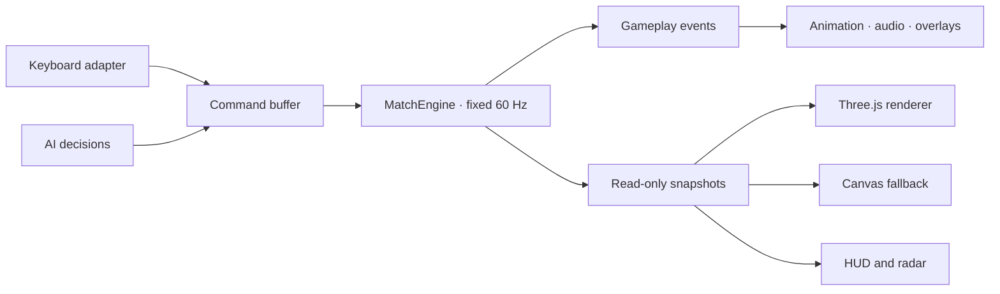

# R1 — Engine and Presentation Boundary

Status: In Progress — Slice D2c snapshot camera, replay, and feedback adapters complete

## Objective

Make authoritative football gameplay runnable and testable without Three.js, Canvas, DOM, audio, or browser frame timing. Presentation becomes a consumer of read-only snapshots and explicit runtime events while current gameplay, controls, assets, and match flow remain behaviorally unchanged.

R1 implements the accepted decisions in ADR-001 and ADR-002. It does not recreate the fixed 60 Hz foundation delivered by G1.

## Current baseline

- Fixed simulation timing already runs at 60 Hz through `SimulationLoop`.
- Locomotion, ball control, and possession helpers already have headless tests.
- `game.js` still owns the compatibility players, ball, match state, AI updates, replay, Three.js/Canvas scene drawing, audio, DOM updates, and debug wiring.
- Browser keyboard listeners and FO4 mapping now live in `src/game/input`; `game.js` temporarily applies their immutable commands until renderer migration is complete.
- Goal, replay, and result presentation consume explicit immutable game events; lifecycle and navigation use semantic application actions instead of synthetic clicks.
- The compatibility runtime captures immutable previous/current snapshots on fixed ticks. HUD/radar consume current snapshots, while WebGL and Canvas consume a shared interpolated player/ball render state.

## Target flow

## Delivery slices

### Slice A — Contracts and dependency guardrails

- Define immutable gameplay commands for movement, sprint, switch player, pass, through ball, lofted pass, shot, tackle, pause, restart, and match start.
- Define explicit runtime events for match lifecycle, possession, kick, score, replay, and match end.
- Define read-only previous/current match snapshots with stable player and ball identifiers.
- Add import-boundary tests proving engine modules do not access DOM, Three.js, Canvas, audio, or browser animation frames.

### Slice B — Authoritative MatchEngine

- Move creation and ownership of players, ball, score, statistics, match clock, selected player, and match lifecycle into a headless `MatchEngine`.
- Reuse the existing fixed clock, locomotion, ball-control, and possession helpers rather than duplicating them.
- Consume commands only inside fixed updates and publish events in deterministic order.
- Preserve current formations, constants, tuning, AI decisions, goal timing, replay behavior, and reset semantics.

### Slice C — Input and application adapters

- Move keyboard listeners and FO4 mapping into a browser input adapter.
- Translate key state into engine commands; input code must not move meshes or mutate player objects directly.
- Replace synthetic navigation clicks with explicit application commands.
- Centralize match start, pause, resume, restart, setup, and main-menu requests behind an application runtime.

### Slice D — Rendering and presentation adapters

- Make WebGL, Canvas fallback, radar, and HUD consume engine snapshots.
- Use snapshot interpolation for visual transforms while retaining fixed authoritative positions.
- Map facing, locomotion, and action state to model orientation and animation without writing back to the engine.
- Replace score/result `MutationObserver` integrations with explicit runtime events.
- Keep model-loading and animation fallbacks intact.

### Slice E — Explicit bootstrap and compatibility cleanup

- Make `game.js` a composition/bootstrap entrypoint instead of the owner of authoritative gameplay updates.
- Initialize presentation modules explicitly; imports must not rely on hidden side effects.
- Remove temporary DOM/state bridges after equivalent command, event, and snapshot tests pass.
- Document final module ownership and retain both WebGL and Canvas smoke paths.

## Implementation checkpoint

- Slice A contracts and dependency guardrails are complete.
- Slice B state/lifecycle foundation is complete.
- Slice B now runs controlled locomotion, stamina, facing, motion state, player bounds/collisions, owned-ball dribbling, loose-ball physics, first touch, possession time, and goal-line detection headlessly inside `MatchEngine`.
- Slice B now also executes short passes, one-twos, through balls, chipped through balls, lofted passes, power/finesse/chip shots, slide tackles, and teammate runs inside the fixed update.
- Kick targeting, lead, speed, curve, vertical velocity, release locks, action animation facts, statistics, and tackle odds preserve the compatibility formulas; random outcomes use the engine's seeded source.
- Successful actions publish explicit ball-kicked, tackle-resolved, teammate-run, and possession events for future presentation adapters.
- Slice B goalkeeper and team AI now run headlessly with deterministic chase, support shape, pressing, attack movement, pressured passing, shooting, goalkeeper positioning, shot projection, dives, rush control, and 520-speed distribution.
- AI decisions use fixed match time and the seeded engine random source; ball actions cross the same immutable command boundary as human actions.
- Defensive W goalkeeper-rush and Q team-press hold state are engine commands ready for the Slice C FO4 keyboard adapter.
- Movement and ball systems reuse the existing locomotion, ball-control, possession, and tuning modules; their fixed-step constants remain unchanged.
- Slice C centralizes the FO4 mapping and keyboard lifecycle in `BrowserInputAdapter`; normalized movement, charge/release actions, defensive holds, standing/slide tackles, Shift-direction switching, blur cleanup, and camera requests preserve the desktop map.
- Slice C centralizes start, pause, resume, restart, Match Setup, and Main Menu requests in `ApplicationRuntime` and `BrowserApplicationAdapter`.
- Match intro and post-match presentation now emit explicit application actions; synthetic `.click()` navigation bridges are removed.
- Slice C unit, static-build, desktop Playwright, narrow-landscape Playwright, and CI-gate validation passed in CI run #247.
- Slice D1 adds `BrowserGameEventBridge` as the compatibility event projection from `game.js` to presentation modules.
- Goal presentation now consumes score/replay events and post-match presentation consumes match-ended score/stat facts; both score/result `MutationObserver` integrations are removed.
- Slice D1 unit validation passed 185 tests. Local Chromium validation passed 24 match-flow scenarios and 10 camera/HUD scenarios across desktop and narrow-landscape. The optional local Firefox software-WebGL mode was not run because this container has no `xvfb-run`; required Chromium desktop, narrow-landscape, and CI-gate jobs passed in CI run #251.
- The persistent local Playwright bootstrap now extracts artifacts without restoring runner ownership, so artifacts work in restricted containers.
- Slice D2a adds a compatibility snapshot adapter that projects legacy Player instances and ball ownership into the same immutable `MatchSnapshot` contract used by `MatchEngine`.
- HUD clock, score, selected identity, stamina, possession, shots, and pass accuracy now come from a pure snapshot projection instead of mutable runtime objects.
- Radar rendering now consumes snapshot players, selected-player ID, and ball facts through a presentation-only renderer shared by WebGL and Canvas fallback paths.
- A deterministic `renderer=canvas` validation mode now proves Canvas fallback HUD/radar parity without requiring WebGL failure.
- Slice D2a validation passed 190 unit tests, the static build, 24 local match-flow scenarios, and 12 local camera/HUD browser scenarios across WebGL/Canvas, desktop, and narrow landscape.
- Slice D2b adds a pure render-state adapter for player position, velocity, facing, locomotion phase, action timing, ball position, height, velocity, and rotation.
- Direction and yaw interpolate across the shortest angular path; same-tick resets and large kickoff teleports snap directly to current transforms instead of sliding across the pitch.
- WebGL model/fallback rigs and Canvas fallback players now use the same interpolated poses and snapshot entity IDs. The 3D rig also faces the interpolated ball rather than mutable compatibility coordinates.
- Replay remains the explicit render override, but playback frames are now immutable `MatchSnapshot` references rather than legacy player/ball copies.
- Slice D2b local validation passed 199 game/R1 tests (including 89 presentation contracts), the static build, 24 match-flow scenarios, and 12 WebGL/Canvas camera-HUD scenarios across desktop and narrow landscape.
- Slice D2c adds a snapshot camera controller that owns presentation-only framing state and reads match/ball facts exclusively from fixed-tick snapshots.
- Replay sampling now owns a bounded 15 FPS snapshot buffer, preserves the 66-frame history and 3.05-second playback window, and exposes read-only playback facts to the compatibility snapshot adapter.
- Kick, tackle, goal, start/restart, and full-time feedback now crosses the immutable browser game-event bridge; a presentation adapter maps those events to audio and contextual particle callbacks.
- Particle simulation remains presentation state in `game.js`, but gameplay actions no longer invoke particle or audio implementations directly.
- Slice D2c focused validation adds snapshot camera, replay, feedback projection, and runtime-boundary contracts; full browser parity remains required before Slice E cleanup.
- Review hardening retains future commands until `targetTick`, snaps snapshot history across start/restart/kickoff discontinuities, keeps custom formations without a number 10 referentially valid, and aligns compatibility scorer events with stable snapshot player IDs.
- Slice D2c local game/R1 validation passes 211 tests and the static build. Browser suites and the filesystem ownership portability test remain delegated to CI in this workspace because Chromium is absent and managed storage rejects `chown`.
- `game.js` remains the live compatibility gameplay owner until Slice D render adapters consume MatchEngine snapshots and browser parity is proven.
- The browser runtime still uses the compatibility simulation in `game.js`; renderer ownership has not moved yet.

## Out of scope

- Gameplay balance or tuning changes.
- New passing, shooting, tackle, goalkeeper, or AI behavior.
- FO4 control remapping.
- Player-model, ball-model, stadium, lighting, or UI redesign.
- Multiplayer, networking, replay-file persistence, backend services, or framework migration.
- Removing Canvas fallback or changing deployment targets.

## Regression risks

- A one-tick input delay when command buffering is introduced.
- Visual jitter or incorrect model facing when snapshot interpolation replaces direct mesh mutation.
- Goal, replay, and post-match event ordering drifting from current timing.
- WebGL and Canvas projections disagreeing about headings or coordinates.
- Reset, Play Again, and Match Setup retaining stale engine state.

Each slice must retain a temporary compatibility adapter until its focused unit, contract, and browser tests pass.

## Validation

### Headless and contract tests

- Start, pause, resume, reset, and end a match without browser globals.
- Feed equal command sequences at 30, 60, and 120 FPS render schedules and obtain equal authoritative snapshots.
- Verify command buffering and deterministic event ordering.
- Verify snapshots are read-only and contain no Three.js, DOM, Canvas, or audio objects.
- Verify rendering and presentation modules cannot be imported by the engine dependency graph.

### Browser tests

- FO4 movement and attacking/defending actions retain their current mappings.
- WebGL player and ball transforms follow engine snapshots without visible jitter.
- Canvas fallback remains playable and agrees with WebGL headings.
- Intro, pause, goal, replay, Full Time, Play Again, Match Setup, and Main Menu flows remain intact.
- Desktop and narrow-landscape Playwright suites pass.
- Static Vercel preview smoke checks return 200 for the page, JavaScript modules, and GLB assets.

### Manual checks

- Compare movement, turning, sprint, possession, passing, shooting, tackling, goalkeeper behavior, and AI behavior against the pre-R1 production build.
- Test both renderers and model/animation fallback modes.
- Confirm no duplicated overlays, sounds, score updates, or match-end actions.

## Definition of Done

- Authoritative gameplay runs headlessly through `MatchEngine` at fixed 60 Hz.
- `game.js` is composition and browser bootstrap, not the authoritative simulation owner.
- Browser input produces commands instead of mutating players, ball, or meshes directly.
- Three.js, Canvas, radar, HUD, audio, and overlays consume snapshots/events only.
- Score and result presentation no longer infer authoritative facts from DOM mutations.
- Existing gameplay tuning and FO4 controls remain unchanged.
- Unit, contract, desktop Playwright, narrow-landscape Playwright, and Vercel preview smoke checks are green.
- Architecture ownership is reflected in `docs/05_ARCHITECTURE.md` and enforced by tests.
- `docs/11_SOURCE_MAP.md` reflects the final entry points, ownership, dependency boundaries, compatibility bridges, and test locations.

## Activation rule

Do not change `docs/01_ACTIVE_SPRINT.md` to R1 until the U3 integrated browser audit is complete and U3.3 is formally closed. One sprint still equals one branch and one pull request.
